# Terraform AWS EC2 VPC Infrastructure

Terraform-based AWS infrastructure project that provisions a custom VPC, public subnets, an Internet Gateway, route tables, security groups, and an EC2 instance.

## Overview

This project demonstrates how to provision foundational AWS infrastructure using Terraform and Infrastructure as Code (IaC). It creates a practical cloud environment that can be used for learning, testing, and showcasing AWS networking and compute provisioning skills.

## Infrastructure Provisioned

This project creates the following AWS resources:

- Custom VPC
- Public subnets
- Internet Gateway
- Route tables
- Route table associations
- Security groups
- EC2 instance
- Output values for provisioned resources

## Repository Structure

```text
.
├── .gitignore
├── .terraform.lock.hcl
├── README.md
├── associated_rtb.tf
├── ec2.tf
├── igw.tf
├── output.tf
├── provider.tf
├── rtb.tf
├── sg.tf
├── subnets.tf
├── variable.tf
├── vpc.tf
└── images/
    ├── image1.png
    ├── image2.png
    ├── image3.png
    ├── image4.png
    ├── image5.png
    ├── image6.png
    ├── image7.png
    ├── image8.png
    ├── image9.png
    ├── image10.png
    ├── image11.png
    └── image12.png
```

## File Purpose

- `provider.tf` - Configures Terraform and the AWS provider
- `vpc.tf` - Creates the VPC
- `subnets.tf` - Creates the subnets
- `igw.tf` - Creates the Internet Gateway
- `rtb.tf` - Defines route tables
- `associated_rtb.tf` - Associates route tables with subnets
- `sg.tf` - Defines security group rules
- `ec2.tf` - Launches the EC2 instance
- `variable.tf` - Declares input variables
- `output.tf` - Exposes resource output values

## Tech Stack

- Terraform
- AWS
- HCL
- Infrastructure as Code (IaC)

## Prerequisites

Before using this project, make sure you have:

- An AWS account
- Terraform installed
- AWS CLI installed and configured
- IAM credentials with permissions to create VPC, subnets, route tables, security groups, and EC2 resources

## How to Use

### 1. Clone the repository

```bash
git clone https://github.com/Ritesh-Prasad/terraform-aws-ec2-vpc.git
cd terraform-aws-ec2-vpc
```

### 2. Initialize Terraform

```bash
terraform init
```

### 3. Validate the configuration

```bash
terraform validate
```

### 4. Preview the execution plan

```bash
terraform plan
```

### 5. Apply the configuration

```bash
terraform apply
```

Type `yes` when prompted to create the infrastructure.

## Destroy Infrastructure

To remove all provisioned resources and avoid unwanted AWS charges:

```bash
terraform destroy
```

## Security Best Practices

- Do not commit `terraform.tfstate` or `terraform.tfstate.backup`
- Do not commit AWS access keys, secret keys, or private keys
- Use `.gitignore` to exclude local state and sensitive files
- Use a remote backend such as Amazon S3 with state locking for production-grade workflows

## Possible Improvements

Future enhancements for this project may include:

- Remote backend using S3 and DynamoDB
- Reusable Terraform modules
- Private subnets and NAT Gateway
- Architecture diagram documentation
- GitHub Actions workflow for `terraform fmt`, `terraform validate`, and `terraform plan`

## Project Screenshots

### Screenshot 1
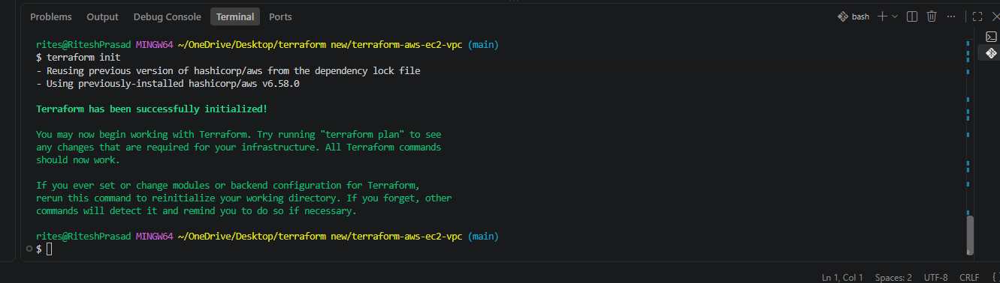

### Screenshot 2
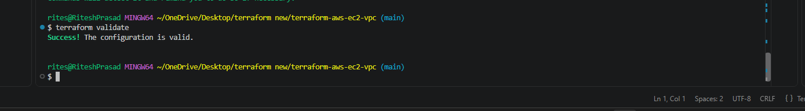

### Screenshot 3
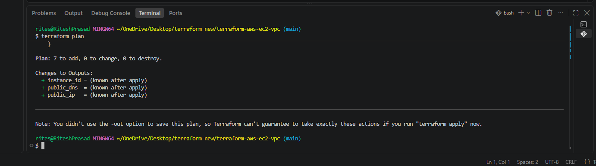

### Screenshot 4
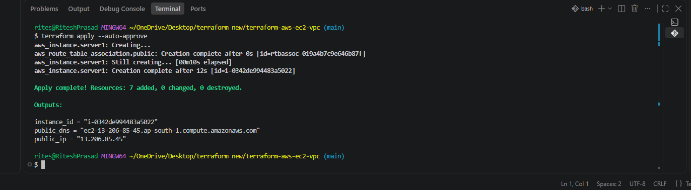

### Screenshot 5
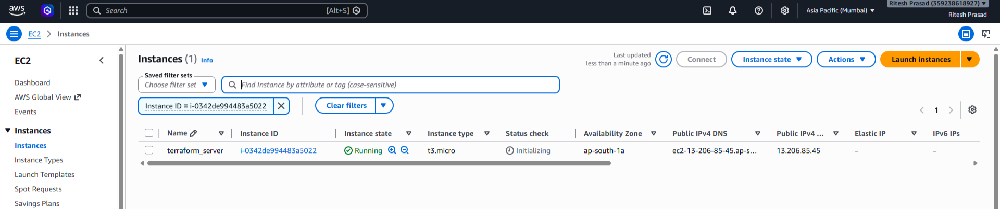

### Screenshot 6
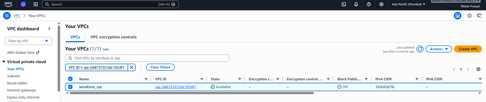

### Screenshot 7
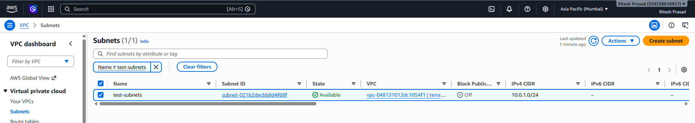

### Screenshot 8
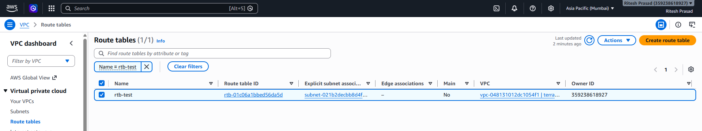

### Screenshot 9
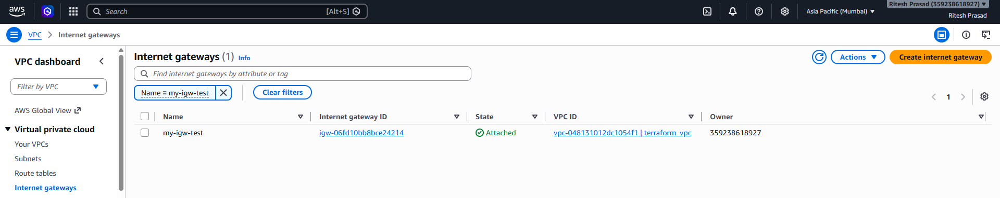

### Screenshot 10
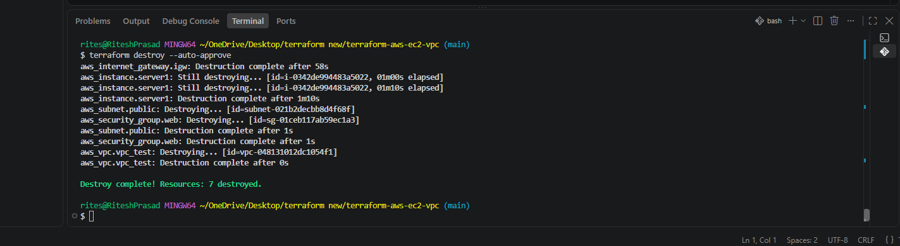

### Screenshot 11
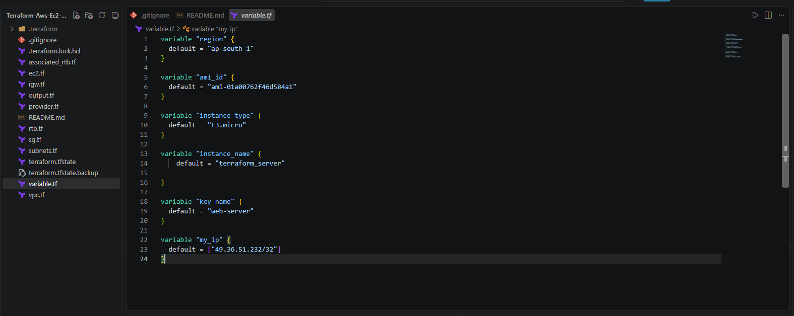

### Screenshot 12
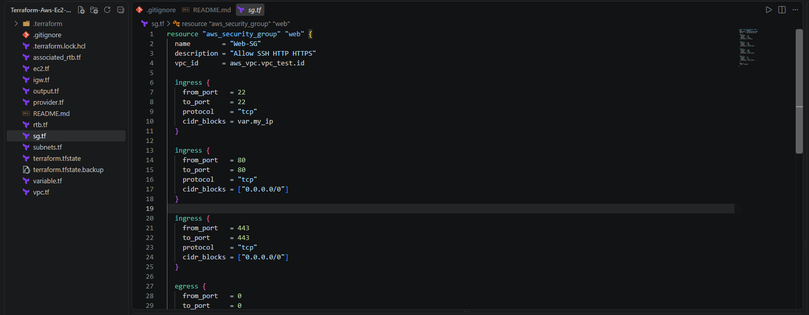

## Release

Current version: `v1.0.0`

## Author

**Ritesh Prasad**  
Cloud and DevOps Engineer